[Mermaid](https://mermaid.js.org/) is a neat diagramming and charting tool that lets you render markdown as a graph or chart, making it a great tool for adding graphs to static site generators such as [Jekyll](https://jekyllrb.com/) or [Hugo](https://gohugo.io/). 

You can write markdown for mermaid graphs and see them rendered in real time on [mermaid.live](https://mermaid.live).

To use it in Jekyll, you have a few options.

### Paste a Few Lines of JS into Your Post

Copy and paste the following html[^1] into your post: 


```markdown
<pre class="mermaid">
graph LR
  a --- b & c --- d
</pre>
<script src="https://cdn.jsdelivr.net/npm/mermaid@10.9.1/dist/mermaid.min.js"></script>
```

...then replace the mermaid text with your own mermaid text. Your done! The example above renders like this:


### Export Mermaid Graph, then Import into Post

Use [mermaid.live](https://mermaid.live) to create a graph, then use their export actions to export to a PNG or SVG. Then you can simply upload the image to your post as you would any other picture.

### Jekyll Plugin
If you really want to use Jekyll to render mermaid markdown using backticks (as you would on GitHub or GitLab), there is a way. It is also much more involved. You need to:

1. Download the [Jekyll Spaceship Plugin](https://github.com/jeffreytse/jekyll-spaceship?tab=readme-ov-file#installation)
2. If using GitHub: [Change your GitHub workflow](https://carsonboden.com/Programming/Jekyll-Pages#github-pages).

Personally, I think method one is easiest, but if you really want to use backticks to denote mermaid graphs, [those](https://github.com/jeffreytse/jekyll-spaceship?tab=readme-ov-file#installation) [two](https://carsonboden.com/Programming/Jekyll-Pages#github-pages) links will help you do it.

---

```mermaid
graph TD
	start["I want to add mermaid<br>to my website"]
	time[How much time am<br>I willing to spend<br>to set it up?]
	easy[Copy/paste a few lines to lines<br>to your post which will import<br>mermaid and create an element<br> to contain your mermaid text.]
	after_medium[Can I just use<br>backticks to create<br>my mermaid graph?]
	style after_medium stroke-dasharray: 5
	medium[Use mermaid.live to create<br>an SVG of your graph,<br>then upload to your post<br>like a normal image.]
	after_easy[But I don't want to<br>have to paste html<br>in my posts.]
	style after_easy stroke-dasharray: 5
	hard[1. Create a github workflow<br>2. Import jekyll-mermaid plugin]
	final[Done! 👏<br>]

	start --> time

	time -- 1 min --> easy
	time -- 3 min --> medium
	time -- 15-30 min --> hard

	easy -- hmm --> after_easy --> time
	easy --> final

	medium -- hmm --> after_medium --> time
	medium --> final

	hard --> final
```

[^1]: Most up to date html found [here](https://www.jsdelivr.com/package/npm/mermaid)
